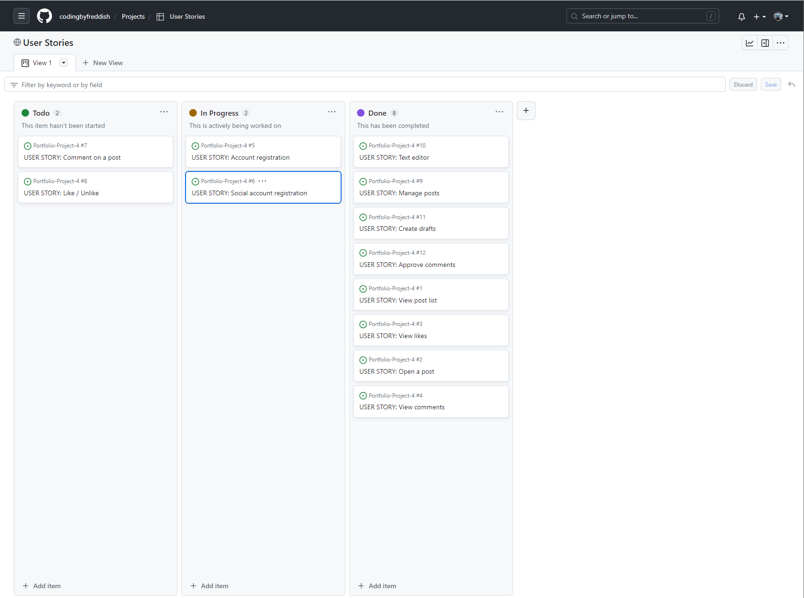
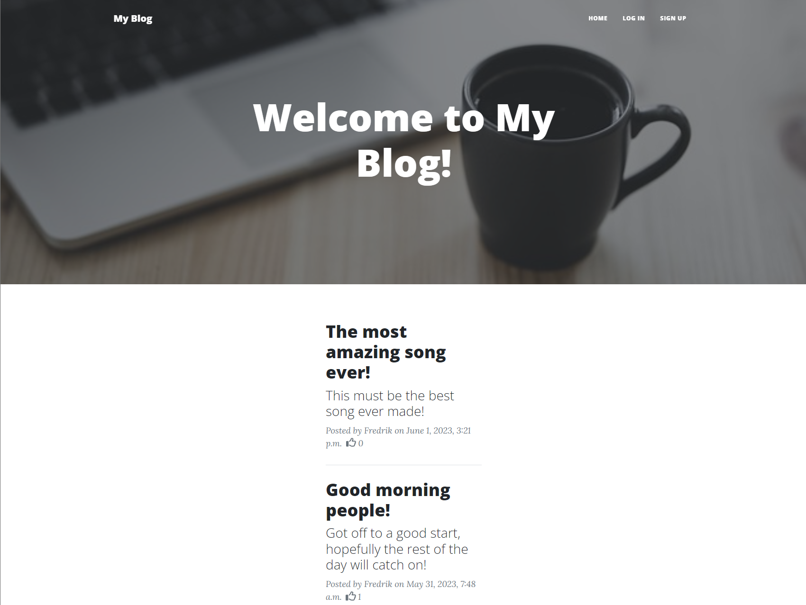
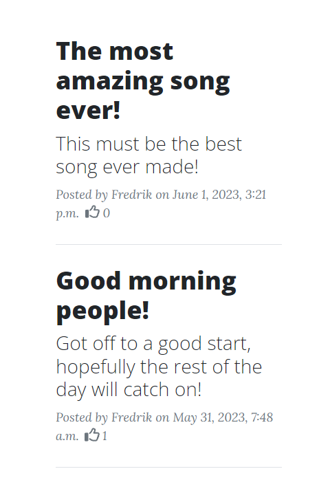
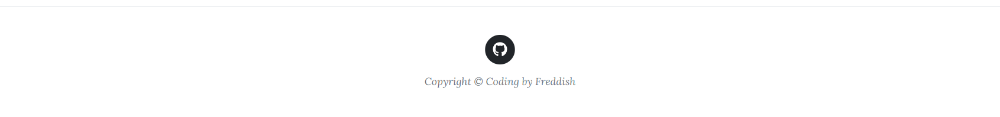
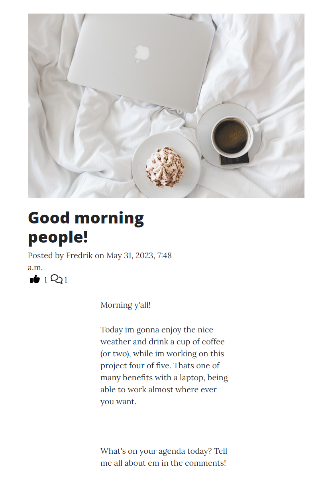

# My Blog
 
 ## Welcome to my fourth Portfolio Project!

This is my fourth project (of five) for my full-stack dev. course at [Code Institute](https://codeinstitute.net). I choose a Blog application for this project. A blog is a good way to show off what Django can do.

  

It runs on on [Heroku](www.heroku.com). The link to the blog can be found [here](https://pp4-byfreddish.herokuapp.com/).

  
 

## Technologies Used

 For this project i used:

 - [Django](https://en.wikipedia.org/wiki/Django_(web_framework))
 - [Bootstrap 5 CSS](https://en.wikipedia.org/wiki/Bootstrap_(front-end_framework))
 - As IDE i used [Visual Studio Code](https://visualstudio.microsoft.com/) and [Gitpod](https://www.gitpod.io/)

 Django Apps used are:

 - [Allauth](https://django-allauth.readthedocs.io/en/latest/)
 - [Ckeditor](https://django-ckeditor.readthedocs.io/en/latest/)
 - [Cripsy Forms](https://django-crispy-forms.readthedocs.io/en/latest/)
 - [Cloudinary](https://pypi.org/project/django-cloudinary-storage/)

 PostgreSQL:

- [ElephantSQL](https://www.elephantsql.com/) as PostgreSQL database hosting service. 
- [Psycopg2](https://www.psycopg.org/docs/) as database adapter. 
- [Dj Database url](https://pypi.org/project/dj-database-url/)  as database url. 

## My Blog - An Agile Approach

I used Agile Management to plan and structure the process of making this website. 
The user stories used where:

- Approve comments: As a Site Admin I can approve or disapprove comments so that I can filter out objectionable comments.
- Create drafts: As a Site Admin I can create draft posts so that I can finish writing the content later.
- Text editor: As a Site Admin I can use a text editor so that I can manage my blog posts with more stylish content.
- Manage posts: As a Site Admin I can create, read, update and delete posts so that I can manage my blog content.
- Like / Unlike: As a Site User I can like or unlike a post so that I can interact with the content.
- Comment on a post: As a Site User I can leave comments on a post so that I can be involved in the conversation.
- Account registration: As a Site User I can register an account so that I can comment and like.
- Social account registration: As a Site User I can register with an social account so that it's easier and faster to log in.
- View comments: As a Site User / Admin I can view comments on an individual post so that I can read the conversation.
- View likes: As a Site User / Admin I can view the number of likes on each post so that I can see which is the most popular or viral.
- Open a post: As a Site User I can click on a post so that I can read the full text.
- View post list: As a Site User I can view a list of posts so that I can select one to read.

I then used Github "project"-feature to set up a board for Todo, In Progress and finally Done. 

Here is a link to the Project on github [My Blog Agile Project](https://github.com/users/codingbyfreddish/projects/13).

## Design and Layout

For this project i used Start Bootstrap's [Clean Blog](https://startbootstrap.com/theme/clean-blog) theme. I've used it before when 
making an app using Flask for a [Code Institute](https://codeinstitute.net) mini-project and thought it would go perfect with this blog.

## Features

* ### Main Page 
    * On the main page the user get the ability to log in or sign up from the links in the navigation bar. The user can also scroll down and read the blog post list, a list of all avaible posts to read. 

 

* ### Log In, Sign Up, Log Out
    * if the user want to comment and/or like the blof post the user can create an account. The user can choose to create an own account using username/password or log in via Google. If the user are currently logged in, the user can choose to log out. 

 

* ### Blog Post List
    * The user can scroll through the diffrent blog posts and choose the ones that catches the users interest. 

 

    

* ### Footer
    * The footer is clean, simple and pragmatic. Just a icon link to my github account with a copyright below.

 

* ### The Blog Post
    * When clicked on the main page the user get redirected to the Blog Post. It contains a image, text and the ablity to like and view comments. If the user is logged in, the user can make a comment. The comment needs approvel before being visable on the page tho.

 

    

* ### RSS feed 
    * The RSS feed (Really Simple Syndication) is a way to show another feature of django, the syndication feed framework.
    The user can add My blog to the browers RSS feed and update then a new blog post is published.
 

## Testing

* ### A total of 8 diffrent tests are done in 3 different files. 
  
    * In [test_models.py](https://github.com/codingbyfreddish/Portfolio-Project-4/blob/main/blogApp/test_models.py) i tested:
        - The number_of_likes method of the Post model
        - The str method and compares it to the expected string
        - That the comments are ordered by -created on

    * In [test_views.py](https://github.com/codingbyfreddish/Portfolio-Project-4/blob/main/blogApp/test_views.py) i tested:
        - The get method of the PostDetail view
        - The post method of the PostDetail view
        - The post method of the PostLike view

    * In [test_forms.py](https://github.com/codingbyfreddish/Portfolio-Project-4/blob/main/blogApp/test_forms.py) i tested:
        - The form with valid data
        - The form with empty data

All tests passed.
 

### Validator Testing

* #### PEP8 Validator
    * The pep8 validator used is from [Code Institute](https://codeinstitute.net)
    * Link to it can be found here: [Python PEP8 validator from CI](https://pep8ci.herokuapp.com/)

Passed with zero errors.

### Bugs

#### No bugs encountered

## Deployment
* Steps for early deployment on [Heroku](https://www.heroku.com/)
    * Create a new Heroku app.
    * Go to Settings,
        - set the needed Config Vars.
    * Go to Deploy
        - Connect the heroku app to the github repository.
        - Click on 'Deploy Branch'.
    
* Steps for final deployment on [Heroku](https://www.heroku.com/)
    * Set 'DEBUG = False' in settings.py
    * Make any adjustments needed in Settings/Config Vars on Heroku
    * Finally; click on 'Deploy Branch' in the Deploy tab.

## Credits/Content
* All the course material from [CI's 'Full Stack Developer'](https://codeinstitute.net/se/full-stack-software-development-diploma/) curriculum leading up to this project.
* [Google](https://console.cloud.google.com/) for the social login API.
* Contains code (models.py/views.py) from [Code Institute](https://codeinstitute.net) miniproject [Django Blog](https://github.com/codingbyfreddish/DjangoBlog)
* Many of the user stories are from [Code Institute](https://codeinstitute.net) miniproject [Django Blog](https://github.com/codingbyfreddish/DjangoBlog)
* Contains code (models.py/views.py) from https://djangocentral.com/building-a-blog-application-with-django/
* Contains code from the documentation from all the "Django Apps used", links up in the section.
* CSS/templates from Start Bootstrap's [Clean Blog](https://startbootstrap.com/theme/clean-blog)
